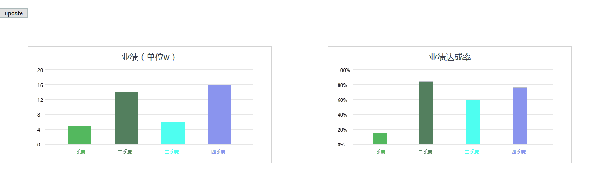

# vue-charts

> A Vue.js project


Usage
NPM
```
npm install vue-charts-jf --save
```

```
import vueChart from 'vue-charts-jf'

Vue.use(vueChart);

```

## vue-bar柱状图

使用示例：
```
    <button @click='updateBar' style='float:left'>update</button>
    <vue-bar ref='vuebar' :barData='barData' :barWid='50' class='barDiv' style='clear:both'></vue-bar>
    
    <vue-bar ref='perbar' :barData='percentData' :maxValue='1' dataType='percent' :tickValue='0.2' :precision='2' class='barDiv' ></vue-bar> 

...
 data () {
    return {
      msg: 'Welcome to Your vue-charts',
      barData:{
        title:'业绩（单位w）',
        list:[
          {color:'#53b85e',title:'一季度',num:5},
          {color:'#53805e',title:'二季度',num:14},
          {color:'#4efff0',title:'三季度',num:6},
          {color:'#8a94ee',title:'四季度',num:16},
        ]
      },
      percentData:{
        title:'业绩达成率',
        list:[
          {color:'#53b85e',title:'一季度',num:0.15},
          {color:'#53805e',title:'二季度',num:0.84},
          {color:'#4efff0',title:'三季度',num:0.6},
          {color:'#8a94ee',title:'四季度',num:0.76},
        ]
      }
    }
  }
...

 methods:{
      updateBar(){
         this.barData.list = [
          {color:'#53b85e',title:'一季度',num:8},
          {color:'#53805e',title:'二季度',num:12},
          {color:'#4efff0',title:'三季度',num:9},
          {color:'#8a94ee',title:'四季度',num:18}
        ]
        this.percentData.list = [
          {color:'#53b85e',title:'一季度',num:0.35},
          {color:'#53805e',title:'二季度',num:0.74},
          {color:'#4efff0',title:'三季度',num:0.56},
          {color:'#8a94ee',title:'四季度',num:0.86},
        ]
        this.$refs.vuebar.draw();
        this.$refs.perbar.draw();
      }
    }

```

参数说明
<table>
<tr>
  <td>参数名称</td>
  <td>类型</td>
  <td>描述</td>
  <td>默认值</td>
  </tr>
  <tr>
  <td>barData</td>
  <td>Object</td>
  <td>可视化数据源</td>
  <td></td>
  </tr>
    <tr>
  <td>tickValue</td>
  <td>Number</td>
  <td>y轴间隔距离</td>
  <td>默认自动计算</td>
  </tr>
    <tr>
  <td>maxValue</td>
  <td>Number</td>
  <td>y轴最大值</td>
  <td>默认自动计算</td>
  </tr>
  <tr>
  <td>dataType</td>
  <td>'int' 或者 'percent'</td>
  <td>y轴以整数显示或百分比数显示</td>
  <td>'int'</td>
  </tr>
  <tr>
  <td>precision</td>
  <td>Number</td>
  <td>数据显示的小数点数</td>
  <td>0</td>
  </tr>
  <tr>
  <td>barWid</td>
  <td>Number</td>
  <td>bar图形的宽度</td>
  <td>30</td>
  </tr>
</table>

barData数据格式：
<table>
<tr>
  <td>参数名称</td>
  <td>类型</td>
  <td>描述</td>
  <td>默认值</td>
  </tr>
  <tr>
  <td>title</td>
  <td>String</td>
  <td>图表的名称</td>
  <td></td>
  </tr>
    <tr>
  <td>list</td>
  <td>Array</td>
  <td>数据列表</td>
  <td>包含数据对象的数组，数据对象格式见下表</td>
  </tr>
</table>

barData.list数据格式：
<table>
<tr>
  <td>参数名称</td>
  <td>类型</td>
  <td>描述</td>
  <td>默认值</td>
  </tr>
  <tr>
  <td>color</td>
  <td>String</td>
  <td>bar图形的颜色</td>
  <td></td>
  </tr>
    <tr>
  <td>title</td>
  <td>String</td>
  <td>bar图形的名称</td>
  <td></td>
  </tr>
  <tr>
  <td>num</td>
  <td>Number</td>
  <td>bar图形的数量</td>
  <td></td>
  </tr>
</table>

方法说明：
<table>
<tr>
  <td>方法名称</td>
  <td>参数</td>
  <td>返回值</td>
  <td>描述</td>
  </tr>
  <tr>
  <td>draw</td>
  <td></td>
  <td></td>
  <td>重新绘制图表，在数据更新后，可调用该方法实现图表重绘</td>
  </tr>
</table>

## vue-circle圆形进度图


使用示例：
```
<div class='circleDiv'>
      <vue-circle :circleData='circleData' style='height:300px' centerText='22' :showTip='true' :showLegend='true' ></vue-circle>
    </div>
    <div class='circleDiv' >
      <vue-circle :circleData='perCircleData' style='height:300px' centerText='22%' :showTip='true' :showLegend='true' :centerStyle='cenStyle'></vue-circle>
    </div>
...
 data () {
    return {
      msg: 'Welcome to Your vue-charts',
      circleData:{
        totle:23,
        list:[
          {num:8,title:'一季度',color:'#53b85e'},
          {num:3,title:'二季度',color:'#53805e'},
          {num:5,title:'三季度',color:'#4e1ff0'},
          {num:7,title:'四季度',color:'#8a94ee'}
        ]
      },
      perCircleData:{
        totle:23,
        list:[
          {num:8,title:'一季度',color:'#53b85e'},
        ]
      },
      cenStyle:{
        fontSize:'24px',
        fontFamily:'sans-serif',
        fontColor:'#999'
      }
    }
  }

```

参数说明
<table>
<tr>
  <td>参数名称</td>
  <td>类型</td>
  <td>描述</td>
  <td>默认值</td>
  </tr>
  <tr>
  <td>circleData</td>
  <td>Object</td>
  <td>可视化数据源</td>
  <td></td>
  </tr>
    <tr>
  <td>centerStyle</td>
  <td>Objectr</td>
  <td>圆心处文字样式</td>
  <td>{
						fontSize:'18px',
						fontFamily:'sans-serif',
						fontColor:'#000',
					}</td>
  </tr>
    <tr>
  <td>showTip</td>
  <td>Boolean</td>
  <td>是否显示提示</td>
  <td>true</td>
  </tr>
  <tr>
  <td>showLegend</td>
  <td>Boolean</td>
  <td>是否显示图例</td>
  <td>true</td>
  </tr>
  <tr>
  <td>precision</td>
  <td>Number</td>
  <td>数据显示的小数点数</td>
  <td>0</td>
  </tr>
  <tr>
  <td>stepLength</td>
  <td>Number</td>
  <td>初始动画进度的步长</td>
  <td>0.05</td>
  </tr>
   <tr>
  <td>intervalTime</td>
  <td>Number</td>
  <td>初始动画进度的间隔</td>
  <td>60</td>
  </tr>
</table>

circleData数据格式：
<table>
<tr>
  <td>参数名称</td>
  <td>类型</td>
  <td>描述</td>
  <td>默认值</td>
  </tr>
  <tr>
  <td>total</td>
  <td>Number</td>
  <td>所有数据的总数</td>
  <td></td>
  </tr>
    <tr>
  <td>list</td>
  <td>Array</td>
  <td>数据列表</td>
  <td>包含数据对象的数组，数据对象格式见下表</td>
  </tr>
</table>

circleData.list数据格式：
<table>
<tr>
  <td>参数名称</td>
  <td>类型</td>
  <td>描述</td>
  <td>默认值</td>
  </tr>
  <tr>
  <td>color</td>
  <td>String</td>
  <td>circle进度图形的颜色</td>
  <td></td>
  </tr>
    <tr>
  <td>title</td>
  <td>String</td>
  <td>circle进度图形的名称</td>
  <td></td>
  </tr>
  <tr>
  <td>num</td>
  <td>Number</td>
  <td>circle进度图形的数量</td>
  <td></td>
  </tr>
</table>

方法说明：
<table>
<tr>
  <td>方法名称</td>
  <td>参数</td>
  <td>返回值</td>
  <td>描述</td>
  </tr>
  <tr>
  <td>draw</td>
  <td></td>
  <td></td>
  <td>重新绘制图表，在数据更新后，可调用该方法实现图表重绘</td>
  </tr>
</table>
